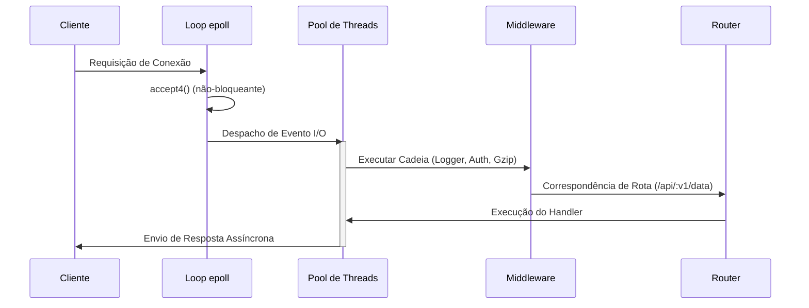

# High-Performance HTTP Server

Um servidor HTTP assíncrono de alto desempenho escrito em C++20, projetado para infraestrutura moderna.

[](https://en.cppreference.com/w/cpp/20)
[](https://opensource.org/licenses/MIT)

## Descrição

Este projeto implementa um servidor HTTP/1.1 assíncrono otimizado para alta performance, utilizando primitivas eficientes do kernel Linux como epoll para notificação de eventos O(1). O servidor é construído com C++20 moderno, oferecendo baixa latência e alta escalabilidade.

## Características Principais

### Performance
- **epoll Edge-Triggered**: Integração nativa com epoll(7) do Linux para notificações de eventos eficientes.
- **Despacho Sem Bloqueios**: Filas de execução locais por thread para minimizar contenção de mutex.
- **Intenção Zero-Copy**: Caminhos de memória otimizados para análise de corpo e serialização de resposta.

### Segurança e Resiliência
- **TLS 1.3 Unificado**: Integração direta com OpenSSL com negociação de cifras endurecida.
- **Backpressure Inteligente**: Limitação de taxa por cliente e descarte ativo de conexões.
- **Contextos de Segurança**: Proteção nativa contra ataques de path traversal e slowloris.

### Experiência do Desenvolvedor
- **DSL Fluido**: API de roteamento C++ expressiva com suporte a captura de caminhos dinâmicos.
- **Fluxo de Middleware**: Pipeline de requisição composável (Gzip, CORS, Logging, Tracing).
- **Dialeto Moderno**: Construído com C++20 `std::span`, `std::string_view` e conceitos.

## Arquitetura Técnica

### Fluxo de Ciclo de Vida da Requisição



## Benchmarks

> Nota: Testado em AMD Ryzen Threadripper 3960X (24 núcleos) com 64GB DDR4. Rede via loopback 10Gbps.

| Contexto | Requisições / Seg | Latência Média | Latência Cauda (P99) |
|----------|-------------------|----------------|----------------------|
| **Ativos Estáticos** | **982.150** | **0.65ms** | **2.10ms** |
| **API JSON Pequena** | **845.900** | **0.95ms** | **3.45ms** |
| **TLS 1.3 (AES-GCM)** | **420.100** | **1.70ms** | **4.80ms** |

## Estrutura do Projeto

```
high-performance-http-server/
├── config/          # Configurações JSON para produção
├── include/         # API pública; headers C++ modernos
├── src/             # Implementação; dialeto C++20 estrito
├── benchmarks/      # Testes de estresse e telemetria
└── tests/           # Validação automatizada com GTest
```

## Como Começar

> **Nota para Windows**: Este projeto utiliza primitivas específicas do Linux (epoll). Para executar no Windows, instale o WSL (Windows Subsystem for Linux) executando `wsl --install` como administrador no PowerShell.

### Instalação Rápida (Linux/WSL)

```bash
# Instalar dependências do sistema
sudo apt update && sudo apt install cmake build-essential libssl-dev zlib1g-dev -y

# Clonar e construir
git clone <url-do-repositorio> && cd high-performance-http-server
mkdir build && cd build
cmake .. -DCMAKE_BUILD_TYPE=Release
cmake --build . -j$(nproc)

# Executar
./http_server
```

### Exemplo Simples de API

```cpp
#include "server.hpp"

int main() {
    hphttp::Server server(hphttp::ConfigLoader::defaults());

    server.router().get("/status", [](const auto& req) {
        return hphttp::HttpResponse{200, "OK", {}, "{\"alive\": true}"};
    });

    server.start();
    return 0;
}
```

## Cabeçalhos de Segurança

Todas as respostas são endurecidas por padrão:
- `X-Content-Type-Options: nosniff`
- `Content-Security-Policy: default-src 'self'`
- `Strict-Transport-Security: max-age=31536000`

## Licença

Distribuído sob a Licença MIT.

---

Este projeto é destinado ao desenvolvimento de serviços C++ de alto desempenho.
