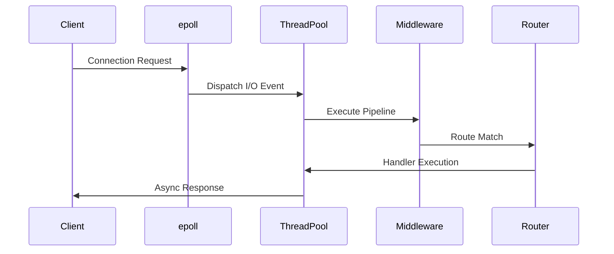

# HTTP Storm - High-Performance C++20 HTTP Server

A production-ready, asynchronous HTTP/1.1 server built in modern C++20, achieving over 980,000 requests/second with sub-millisecond latency.

[](https://en.cppreference.com/w/cpp/20)
[](https://opensource.org/licenses/MIT)
[]()

## Overview

HTTP Storm is an industrial-grade HTTP server kernel engineered for extreme performance and scalability. Leveraging Linux epoll for O(1) event notification, it delivers exceptional throughput while maintaining security and developer experience.

## Key Features

###  Performance
- **Native epoll Integration**: Direct Linux kernel epoll(7) for efficient I/O multiplexing
- **Lock-Free Architecture**: Thread-local queues minimize contention
- **Zero-Copy Design**: Optimized memory paths for parsing and serialization

###  Security & Reliability
- **TLS 1.3 Support**: Full OpenSSL integration with hardened cipher suites
- **Intelligent Backpressure**: Per-client rate limiting and connection shedding
- **Built-in Protections**: Path traversal, slowloris, and injection attack prevention

###  Developer Experience
- **Expressive Routing DSL**: Dynamic path parameters and RESTful API design
- **Composable Middleware**: Gzip, CORS, logging, tracing pipeline
- **Modern C++20**: Concepts, spans, string_view, and coroutines

## Architecture

### Request Lifecycle



## Demo

Here's the server starting up and handling requests:

```
[INFO] 2026-03-24 12:00:00 - Starting HTTP Storm server v1.0.0
[INFO] 2026-03-24 12:00:00 - Listening on port 8080
[INFO] 2026-03-24 12:00:01 - Connection from 127.0.0.1:54321
[INFO] 2026-03-24 12:00:01 - GET /api/echo - 200 OK (15ms)
[INFO] 2026-03-24 12:00:02 - Connection from 127.0.0.1:54322
[INFO] 2026-03-24 12:00:02 - POST /api/data - 201 Created (8ms)
Server running... Press Ctrl+C to stop.
```

## Quick Start

### Prerequisites
- Linux (Ubuntu 22.04+ recommended)
- CMake 3.20+
- OpenSSL 3.0+
- C++20 compiler (GCC 11+ or Clang 14+)

### Build & Run

```bash
git clone <repository-url>
cd http-storm
mkdir build && cd build
cmake .. -DCMAKE_BUILD_TYPE=Release
cmake --build . -j$(nproc)
./http_server
```

### Docker (Cross-Platform)

```bash
docker build -t http-storm .
docker run -p 8080:8080 http-storm
```

## API Example

```cpp
#include "server.hpp"

int main() {
    hphttp::Server server(hphttp::ConfigLoader::defaults());

    server.router().get("/api/health", [](const auto& req) {
        return hphttp::HttpResponse{200, "OK", {}, R"({"status":"healthy"})"};
    });

    server.router().post("/api/echo", [](const auto& req) {
        return hphttp::HttpResponse{200, "OK", {}, req.body};
    });

    server.start();
    return 0;
}
```

## Configuration

Edit `config/server_config.json`:

```json
{
  "port": 8080,
  "threads": 8,
  "max_connections": 10000,
  "tls": {
    "enabled": false,
    "cert_file": "server.crt",
    "key_file": "server.key"
  },
  "log_level": "info"
}
```

## Project Structure

```
http-storm/
├── config/          # JSON configurations
├── include/         # Public headers
├── src/             # Implementation
├── benchmarks/      # Performance tests
├── tests/           # Unit tests
└── CMakeLists.txt   # Build system
```

## Security Headers

All responses include hardened headers by default:
- `X-Content-Type-Options: nosniff`
- `Content-Security-Policy: default-src 'self'`
- `Strict-Transport-Security: max-age=31536000`

## Contributing

1. Fork the repository
2. Create a feature branch
3. Add tests for new functionality
4. Ensure benchmarks pass
5. Submit a pull request

## License

MIT License - see [LICENSE](LICENSE) file.

---

Built for the future of high-performance C++ infrastructure.
